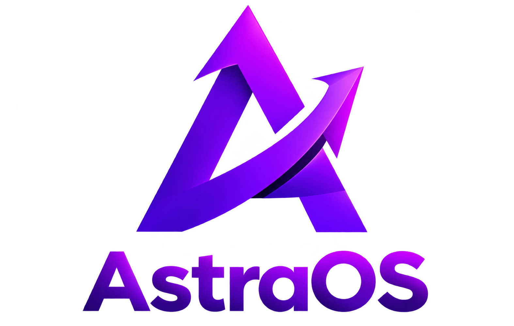

<div align="center">



# ✦ AstraOS

### Un système d'exploitation Linux moderne, performant.

<br>


</div>

---

## ✦ Présentation

**AstraOS** est un système d'exploitation Linux basé sur **Arch Linux**, conçu avec une approche centrée sur trois principes :

> **Performance · Élégance · Indépendance**

Le projet développe progressivement sa propre expérience utilisateur autour de **Rust, GTK4 et Wayland**, tout en conservant la compatibilité avec l'écosystème Arch Linux.

---

## 🚀 Vision

AstraOS vise à proposer une expérience Linux moderne et cohérente, avec :

* ⚡ **Performance** — une base légère et optimisée
* 🎨 **Interface moderne** — design glassmorphism, transparence et animations
* 🛡️ **Indépendance** — une interface et des composants propres à AstraOS
* 🌍 **Accessibilité** — français par défaut et support multilingue prévu
* 🔓 **Open source** — code accessible et transparent

---

## 🧩 Architecture

AstraOS est organisé autour de plusieurs couches :

```text
┌─────────────────────────────────────────────┐
│                   AstraOS                   │
├─────────────────────────────────────────────┤
│                                             │
│              USER INTERFACE                 │
│                                             │
│          Rust + GTK4-rs + Wayland           │
│                                             │
├─────────────────────────────────────────────┤
│                                             │
│              ASTRA COMPONENTS               │
│                                             │
│  Shell · Apps · Update · Defender · Gaming  │
│                                             │
├─────────────────────────────────────────────┤
│                                             │
│              HYPRLAND / WAYLAND             │
│                                             │
├─────────────────────────────────────────────┤
│                                             │
│                 ARCH LINUX                  │
│                                             │
│   Linux · systemd · pacman · PipeWire       │
│   NetworkManager · Mesa · glibc             │
│                                             │
└─────────────────────────────────────────────┘
```

### Pourquoi Rust ?

Rust est utilisé pour les futurs composants AstraOS nécessitant performance et sécurité mémoire, notamment **Astra Shell** et les applications développées spécifiquement pour le système.

---

## 📦 Packs

Plusieurs éditions sont prévues :

| Édition             | Utilisation                                |
|---------------------| ------------------------------------------ |
| ⭐ **Core**         | Installation minimale et base AstraOS      |
| 🧑‍💻 **Developer**    | Environnement destiné aux développeurs     |
| 🏢 **Bureautique**  | Utilisation quotidienne et professionnelle |
| 🎮 **Gaming**       | Expérience orientée jeux vidéo             |

---

## 🗺️ Roadmap

### Phase 1 — v1.0

| ISO       | Version | Contenu                            | État                |
| --------- | ------: | ---------------------------------- | ------------------- |
| **ISO 1** |     0.1 | Arch Linux + Hyprland + branding   | ✅ Disponible        |
| ISO 2     |     0.2 | Astra Shell + Welcome Screen       | ✅ Disponible        |
| ISO 3     |     0.3 | Applications système               | 🔜 En développement  |
| ISO 4     |     0.4 | AstraPass + Widgets + Jeux         | ⏳ Prévu             |
| ISO 5     |     0.5 | Astra Defender + Task Manager      | ⏳ Prévu             |
| ISO 6     |     0.6 | Astra Assistant + outils système   | ⏳ Prévu             |
| ISO 7     |     1.0 | Gaming Launcher + Calamares + i18n | ⏳ Prévu             |

### Après la v1.0

Les phases suivantes prévoient notamment :

* Astra Bridge
* Astra Mail
* Astra Sync
* Astra Store
* Astra Photos
* Astra Gaming Launcher
* Astra Phone Sync
* Astra WinBox
* Astra Mobile
* Support ARM
* Waydroid

---

## 🎨 Identité visuelle

### Couleurs

| Nom         | Valeur                  |
| ----------- | ----------------------- |
| Indigo      | `#818cf8`               |
| Violet      | `#8b5cf6`               |
| Magenta     | `#E040FB`               |
| Dark        | `#0b0d17`               |
| Glass Panel | `rgba(22, 25, 40, 0.7)` |

### Polices

* **Outfit** — Titres et identité
* **Inter** — Texte
* **JetBrains Mono** — Code et terminal

### Assets

```text
astraos-iso1/
└── assets/
    ├── logos/
    │   ├── logo-astraos.png
    │   └── logo-boot.png
    │
    ├── wallpapers/
    └── fonts/
```

---

# ® Utilisation du logo et de la marque

> **Important : le code source et l'identité visuelle d'AstraOS sont traités séparément.**

Le code du projet est distribué sous **licence MIT**.

Les **logos, éléments graphiques, noms, marques et éléments de branding AstraOS ne sont pas automatiquement couverts par la licence MIT**.

### 🚫 Utilisation commerciale interdite

L'utilisation des logos AstraOS à des **fins commerciales ou lucratives est interdite sans autorisation préalable**.

Cela inclut notamment :

* vendre le logo ou une version modifiée du logo ;
* utiliser le logo sur un produit vendu ;
* utiliser le logo dans un service commercial ;
* intégrer le logo dans une offre payante ;
* utiliser le logo pour promouvoir un produit ou service commercial ;
* créer une identité visuelle dérivée pouvant être confondue avec AstraOS.

### ✅ Utilisation non commerciale

L'utilisation du logo à des fins **personnelles, éducatives ou de présentation du projet** peut être autorisée, à condition de ne pas créer de confusion avec le projet officiel.

---

## 📜 Licence du code

Le code source d'AstraOS est distribué sous licence **MIT**.

Voir le fichier [`LICENSE`](LICENSE).

> **MIT pour le code ≠ licence libre pour les logos.**

---

## 📁 Structure du projet

```text
AstraOS-Beta/
│
├── astraos-iso1/
│   └── assets/
│       ├── logos/
│       │   ├── logo-astraos.png
│       │   └── logo-boot.png
│       ├── wallpapers/
│       └── fonts/
│
├── astra-shell/
├── astra-apps/
├── astra-core/
├── docker/
├── docs/
├── scripts/
│
├── Makefile
├── LICENSE
└── README.md
```

---

## 👥 Crédits

**AstraOS Project**

* **Concept & Direction** — naou_m
* **Développement** — naou_m GLM 5.2 (Assitant)
* **Base technique** — Arch Linux
* **Logo & Branding** — MMT Studio

---

## 🔗 Liens

* **Repository** — https://github.com/naoum40/AstraOS-Beta
* **Issues** — https://github.com/naoum40/AstraOS-Beta/issues
* **Documentation** — [`docs/`](docs/)
* **Roadmap** — [`docs/ROADMAP.md`](docs/ROADMAP.md)
* **Architecture** — [`docs/ARCHITECTURE.md`](docs/ARCHITECTURE.md)
* **Build Guide** — [`docs/BUILD.md`](docs/BUILD.md)

---

<div align="center">

### ✦ AstraOS

**Built with 🧡 by AstraOS Project**

</div>
